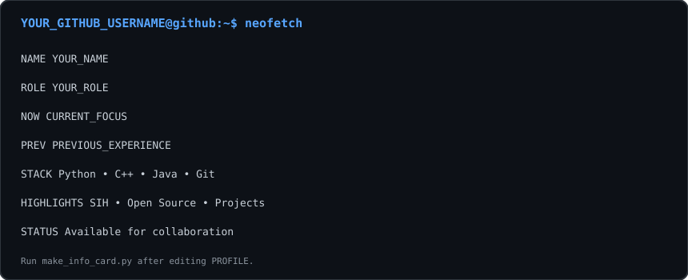

<div align="center">

### <code>Anshuman118@github ~ $ ./contributions.sh</code>



<br><br>

### <code>Anshuman118@github ~ $ whoami</code>

<table>
  <tr>
    <td valign="top">
      
    </td>
    <td valign="top">
      
    </td>
  </tr>
</table>

<br>

### <code>Anshuman118@github ~ $ cat stack.txt</code>

<pre>
Python • C++ • JavaScript • Git • GitHub
</pre>

### <code>Anshuman118@github ~ $ exit</code>

</div>

---

## Customize

The profile uses self-contained SVGs: the README only embeds them, while all animation lives inside the SVG files. No JavaScript, external CSS, third-party statistics widget, personal access token, or GitHub GraphQL API is required.

### Profile settings

| Change | Edit |
|---|---|
| Name, role, current focus, experience, stack, highlights | `scripts/make_info_card.py` → `PROFILE` |
| GitHub username | `scripts/make_info_card.py`, workflow `GITHUB_USERNAME`, and the prompts in this README |
| Portrait source and preparation | Run `python scripts/prep_photo.py YOUR_PHOTO.jpg` |
| ASCII colors, grid, or animation speed | `scripts/make_ascii_svg.py` |
| Heatmap colors, dimensions, or animation speed | `scripts/render_heatmap_svg.py` |
| Daily contribution data | Generated in `data/contributions.json` |
| Image widths | The `width` attributes in this README |

### Local setup

macOS/Linux:

```bash
python3 -m venv .venv
source .venv/bin/activate
python -m pip install -r scripts/requirements.txt
```

Windows PowerShell:

```powershell
py -3.11 -m venv .venv
.venv\Scripts\Activate.ps1
python -m pip install -r scripts\requirements.txt
```

Windows Command Prompt:

```bat
py -3.11 -m venv .venv
.venv\Scripts\activate.bat
python -m pip install -r scripts\requirements.txt
```

Pillow, NumPy, OpenCV, and rembg are only needed to create the portrait locally. The daily GitHub Actions workflow installs only requests and Beautiful Soup for the heatmap refresh.

### Build and preview

Place a portrait at any local path, then run:

```bash
python scripts/prep_photo.py source-photo.jpg
python scripts/make_ascii_svg.py
python scripts/make_info_card.py
python scripts/fetch_contributions.py --username Anshuman118
python scripts/render_heatmap_svg.py
```

The first command writes `source-prepped.png`, which the ASCII generator reads by default. Open the generated SVG files in a modern browser to preview them.

### Publishing the profile repository

A GitHub profile repository must have the exact same name as the GitHub username. GitHub displays this repository’s `README.md` at the top of that user’s profile.

```bash
gh repo create Anshuman118 --public --clone
cd Anshuman118
mkdir -p scripts data .github/workflows
```

After copying this project into that repository and generating the assets:

```bash
git add .
git commit -m "build animated profile README"
git push
```

### Daily refresh

`.github/workflows/update-profile-art.yml` runs daily at 06:17 UTC and can also be started manually from the Actions tab. It regenerates only:

- `data/contributions.json`
- `contrib-heatmap.svg`

The portrait and information card stay unchanged until regenerated locally.
